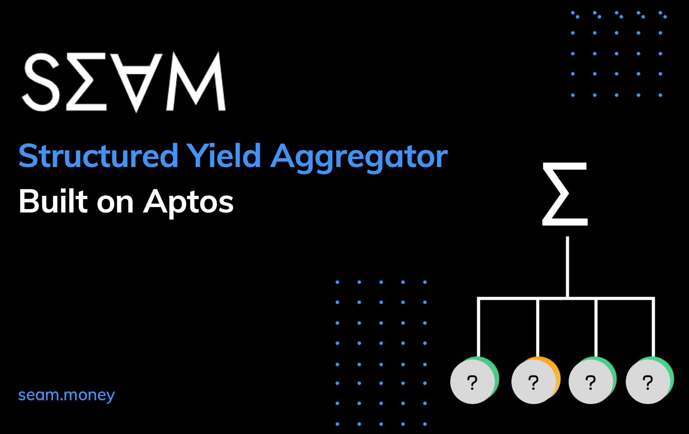

import Bleed from 'nextra-theme-docs/bleed'

# Seam

Structured staking, Yield composer & multi-purpose Explorer for Aptos

Seam is building the first composable products platform on aptos
 staking + yield platform for LPs for institutions and everyday users on aptos.

**what we are building** 
1. Seam Staking - staked APT as a defi primitive (will explain how this is different from liquid staking)
2. Seam Yield : multi-protocol composed stratigies 
3. Seam Dao : participant incentivized validator management platform and tooling

Seam aims to add value and composability to the aptos ecosystem
by: 
1. providing a mechanism for transferring of the ability to claim a stake position on a validator(s) 
2. allow the sale of these contracts via (traditional,dutch and fixed auctions) 
3. allow users to compose complex positions across Pools, Orderbooks and lending markets

## What Is live right now on our site 

### Module Explorer:
this allows users to enter an account address and inspect the modules deployed by the account. From this view the user can also see the recent transactions of the account, the accounts resources, and module schema. Right now this isn't super useful but it was a useful interface to build alongside our protocol.

we are hoping to extend this interface to provide a simple ui for anyone to interact directly with any dapps' or accounts modules.

### Dapp Explorer:

The Dapp explorer section of the explorer page acts as a single view for a user to navigate the Aptos ecosystem. In its current state it is far from it.  After te 3

### What is   

<Bleed></Bleed>
